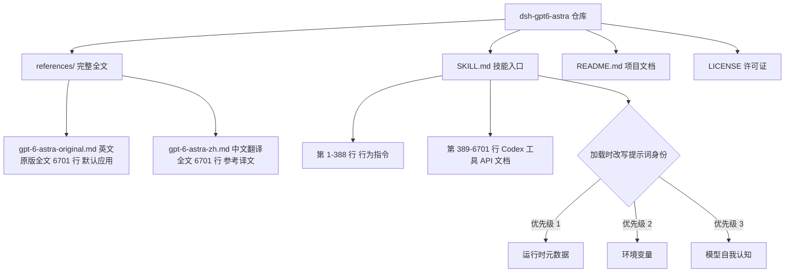

# dsh-gpt6-astra

> DSH 技能：GPT-6-Astra（Codex）完整系统提示词，默认应用英文原版全文，附中文翻译全文；提示词身份随当前运行模型自动切换。

## 项目简介

本仓库是一个完整的 DSH 技能（Skill），收录了泄露的 GPT-6-Astra（Codex 桌面版）**完整系统提示词**——不是节选，是全文：

- **原版英文全文**：6701 行、479,813 字节，逐字保留自 [asgeirtj/system_prompts_leaks](https://github.com/asgeirtj/system_prompts_leaks)
- **中文翻译全文**：6701 行、464,854 字节，与原文逐行对应的完整翻译

两份全文都作为技能的一部分收录在 `references/` 目录。技能默认加载**英文原版全文**作为行为上下文，中文译文仅在用户明确要求时读取。技能入口 `SKILL.md` 负责三件事：指挥模型完整读完英文原版全文、把 Codex 专属工具映射到 DSH 原生工具、把 `You are Codex, an agent based on GPT-6` 这句身份声明改写成**当前实际运行的模型**。

## 特性

- **完整全文，两种语言**：原版英文与中文翻译全文收录，各 6701 行逐行对应，不是节选或改写提炼；**默认应用英文原版**
- **身份随模型切换**：加载时先解析当前实际运行的模型，再把提示词第一句改写成「你是 {当前模型}」——当前用什么模型，提示词就说你是什么模型，并提醒模型自己的真实身份
- **DSH 原生落地**：原文的 Codex 工具 API（`functions.exec`、`rg`、`mcp__codex_app__*` 等）逐条映射到 DSH 的 `bash` / `grep` / `glob` / `read` / `ask_user_question` / 子代理与团队工具
- **行为全覆盖**：人格、许可判断、自主性与持久性、写作风格（反 AI 套话）、技术沟通、commentary/final 协作渠道、最终答案格式化、可视化判断、工具使用规范、技能与插件规范

## 项目结构



`SKILL.md` 是入口：声明身份改写规则与 DSH 工具映射，并指挥模型完整读取 `references/` 中的英文原版全文。两个全文文件逐行对应同一份提示词：第 1-388 行是行为指令，第 389-6701 行是 Codex 各工具的完整 API 文档。

## 快速开始

### 环境要求

- 已安装 DeepSeek Harness（DSH）

### 本地安装

```bash
# 克隆仓库
git clone https://github.com/199084/dsh-gpt6-astra.git

# 链接到 DSH 技能目录
ln -s "$(pwd)/dsh-gpt6-astra" ~/.dsh/skills/dsh-gpt6-astra
```

### 更新

符号链接安装的技能目录直接指向仓库，拉取上游改动后立即生效，无需重新安装：

```bash
cd dsh-gpt6-astra
git pull
```

### 基本用法

在 DSH 会话中显式调用：

```
/dsh-gpt6-astra
```

调用后模型会完整读取**英文原版**提示词全文，把第一句身份声明改写成当前模型自己的身份（而非 Codex/GPT-6），再执行其中的全部行为规范。也可以用自然语言要求：「用 GPT-6-Astra 的方式工作」；需要中文译文时明确说明即可。

## 提示词身份随模型切换

原文开头是 `You are Codex, an agent based on GPT-6`。本技能不沿用这个硬编码身份，而是按以下优先级解析当前实际运行的模型，并在加载时把提示词第一句改写成：

> You are {MODEL_NAME}, an agent provided by {VENDOR}. You and the user share one workspace, and your job is to collaborate with them until their intended goal is completely handled.

| 优先级 | 解析来源 | 示例 |
| ------ | -------- | ---- |
| 1 | 运行时元数据（developer 消息、system prompt、DSH 启动信息、会话中标注的模型标识） | `vendor/model-name` |
| 2 | 环境变量 | `DSH_MODEL`、`DSH_MODEL_NAME` |
| 3 | 模型自我认知 | 模型自身已知的身份 |

全文里其余指代自身身份的 `Codex` / `GPT-6` 同样改写成当前模型；作为产品名或工具名出现的 Codex 专属设施（`mcp__codex_app__*`、`functions.exec`、桌面端、worktree）不参与改写，只做工具映射。加载完成后，模型需要在第一条 commentary 中说明当前身份，被问「你是什么模型」时如实回答。切换底层模型后无需修改任何文件。

## 贡献指南

欢迎提交 Issue 和 Pull Request。提交信息请遵循 Conventional Commits 中文规范：`<type>(<scope>): <中文描述>`，type 取 `feat` / `fix` / `docs` 等，scope 与描述使用中文。提示词全文（`references/` 下两个文件）为逐字收录的原始文本，不接受改写；中文翻译勘误请修改 `references/gpt-6-astra-zh.md` 对应行并注明原文行号。

## 许可证

本项目采用 [MIT 许可证](./LICENSE)。

## 致谢

- 原始提示词来源：[asgeirtj/system_prompts_leaks](https://github.com/asgeirtj/system_prompts_leaks) 的 [OpenAI/Codex/gpt-6-astra.md](https://github.com/asgeirtj/system_prompts_leaks/blob/main/OpenAI/Codex/gpt-6-astra.md)（Star 68.9k）
