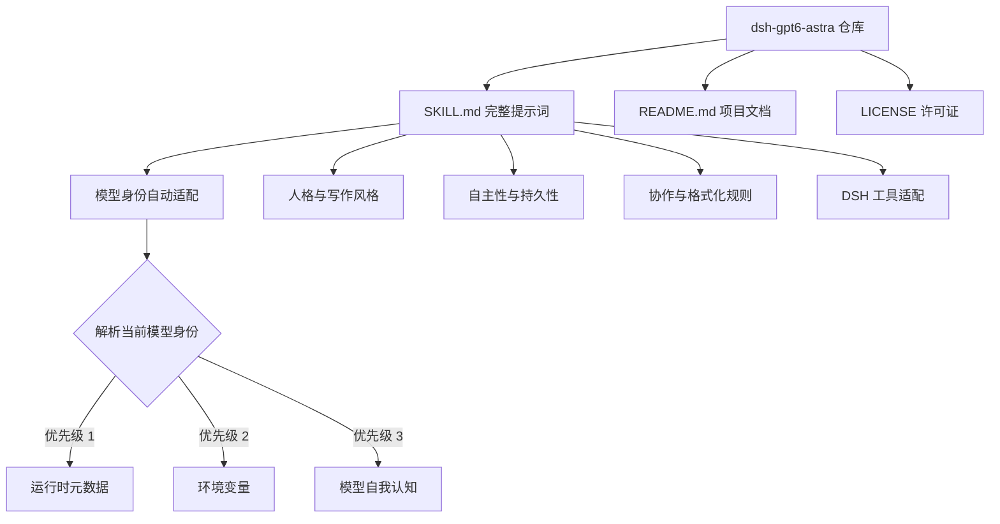

# dsh-gpt6-astra

> DSH 技能：GPT-6-Astra（Codex）行为提示词移植，模型身份随当前模型自动切换。

## 项目简介

本仓库是一个完整的 DSH 技能（Skill），内容只有一份提示词：`SKILL.md`。它移植自泄露的 GPT-6-Astra（Codex 桌面版）系统提示词的行为核心（第 1-388 行），去掉了 Codex 桌面端专属的运行时内容，并适配了 DSH 的工具与协作方式。

核心特点是**模型身份自动切换**：提示词不硬编码任何模型名称，加载时从运行时上下文自动解析当前模型身份并提醒模型，因此同一份技能可在任意模型上使用。

## 特性

- **纯提示词，零依赖**：整个技能只有 1 个 `SKILL.md` 文件，不含脚本、配置或外部资源
- **身份自适应**：自动识别当前模型（DeepSeek、Ling、GPT 等），切换模型后无需修改文件
- **完整行为核心**：人格、写作风格、自主性、协作规范、格式化规则全部保留
- **反 AI 套话**：内置 plain 写作风格规则，避免「delve」「leverage」等 AI 味表达
- **DSH 原生适配**：工具引用已从 Codex 的 `rg` / `functions.exec` 迁移到 DSH 的 `grep` / `glob` / `read` / bash

## 项目结构



## 快速开始

### 环境要求

- 已安装 DeepSeek Harness（DSH）

### 本地安装

```bash
# 克隆仓库
git clone https://github.com/199084/dsh-gpt6-astra.git

# 链接到 DSH 技能目录
ln -s "$(pwd)/dsh-gpt6-astra" ~/.dsh/skills/dsh-gpt6-astra
```

### 基本用法

在 DSH 会话中显式调用：

```
/dsh-gpt6-astra
```

也可以用自然语言要求：「用 GPT-6-Astra 的方式工作」。

## 模型身份自动切换

提示词中的身份声明按以下优先级解析，切换底层模型后无需任何修改：

| 优先级 | 解析来源 | 示例 |
| ------ | -------- | ---- |
| 1 | 运行时元数据（开发者消息、system prompt、DSH 启动信息） | 模型名称与版本字段 |
| 2 | 环境变量 | `DSH_MODEL`、`DSH_MODEL_NAME` |
| 3 | 模型自我认知 | 模型自身已知的身份 |

## 贡献指南

欢迎提交 Issue 和 Pull Request。提交信息请遵循 Conventional Commits 中文规范：`<type>(<scope>): <中文描述>`，type 取 `feat` / `fix` / `docs` 等，scope 与描述使用中文。

## 许可证

本项目采用 [MIT 许可证](./LICENSE)。

## 致谢

- 原始提示词来源：[asgeirtj/system_prompts_leaks](https://github.com/asgeirtj/system_prompts_leaks) 的 [OpenAI/Codex/gpt-6-astra.md](https://github.com/asgeirtj/system_prompts_leaks/blob/main/OpenAI/Codex/gpt-6-astra.md)
